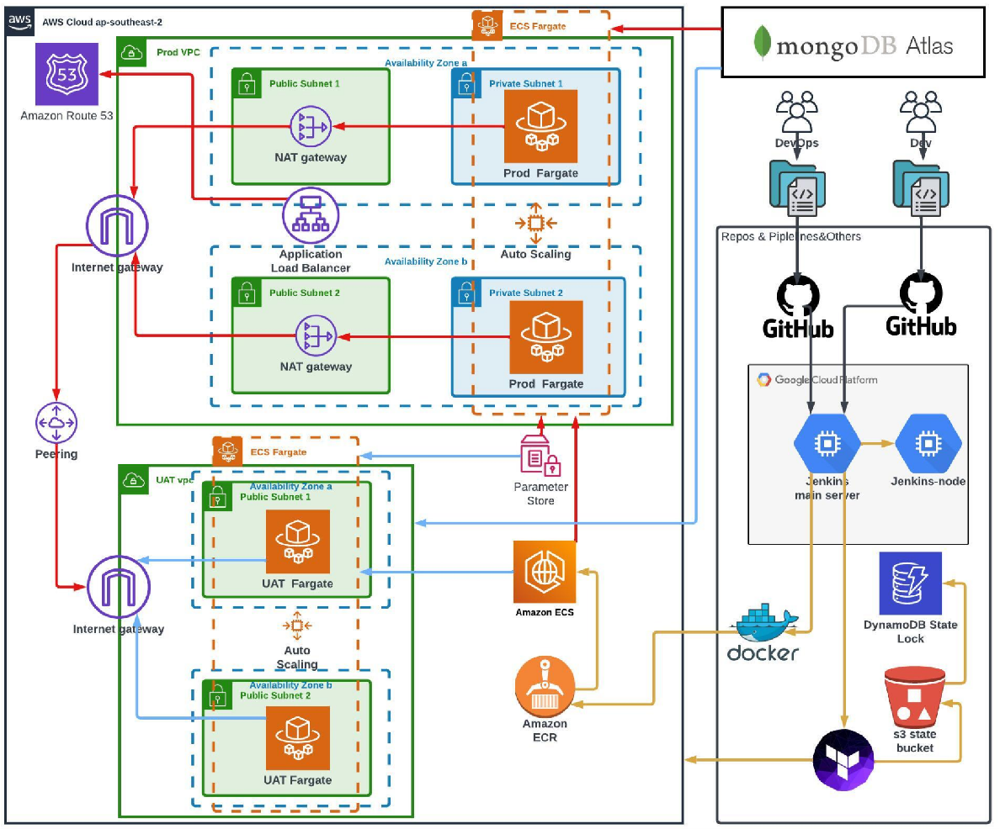
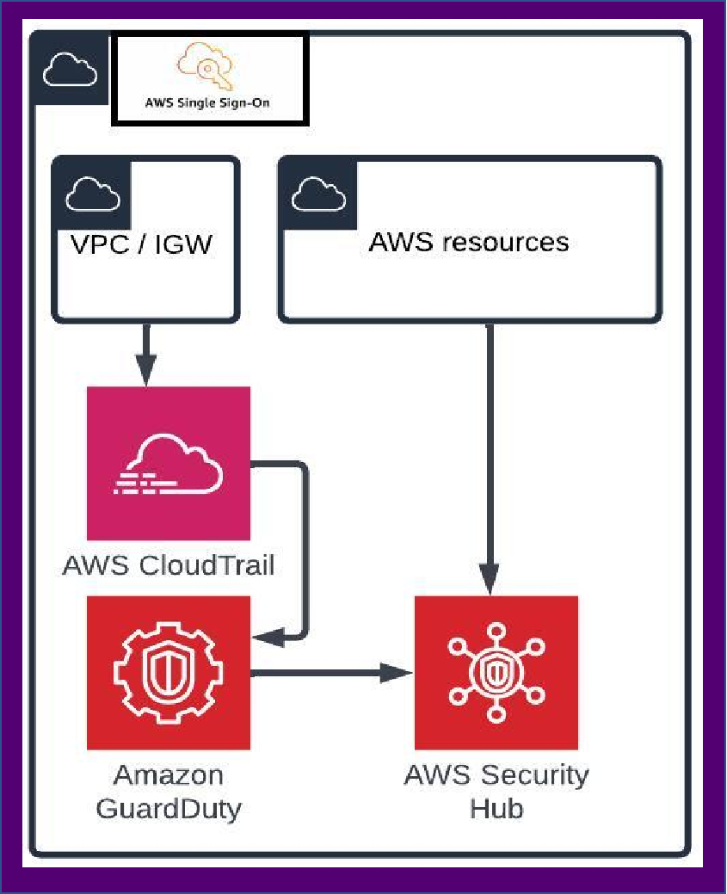

## Project Overview

### Tech Stack

- **Frontend**: TypeScript, React
- **Backend**: Node.js, Express
- **Infrastructure as Code (IaC)**: Terraform, AWS CloudFormation
- **CI/CD**: Jenkins, GitHub Actions, Bitbucket Pipelines
- **Monitoring**: Prometheus, Grafana, ELK Stack (Elasticsearch, Logstash, Kibana)
- **Cloud Providers**: AWS,AZure,GCP

**Architecture Diagram:**

## Project Components

### Frontend

The frontend is built using TypeScript and React. It involves setting up a local development environment, running the application locally, and deploying the frontend to the cloud.

**Frontend Architecture:**  

### Backend

The backend is developed using Node.js and Express. It requires setting up cloud infrastructure for the backend services, connecting to the database, and ensuring the backend operates correctly.

**Procedures:**
- Set up the backend environment.
- Deploy backend services and set up database connections.
- Script backend deployment using IaC tools.
- Optimize backend performance and infrastructure.

**Backend Architecture:**  

### Monitoring

Monitoring involves setting up tools to track the performance and availability of both frontend and backend services. Tools like Prometheus and Grafana are used for this purpose.

**Procedures:**
- Select and set up monitoring tools.
- Implement health checks and performance monitoring for frontend and backend.
- Configure alerts for prompt issue resolution.
- Use the ELK stack for log management and analysis.

**Monitoring Diagram:**  
  
  

### Security

Security tasks focus on integrating security tools and practices into the CI/CD pipeline to ensure that the application and infrastructure are secure.

**Procedures:**
- Integrate security scans in the CI/CD pipeline using tools like SonarQube and Snyk.
- Implement cloud platform security tools.
- Ensure least privilege access for all services.
- Set up a Vault server for credential management.

**Security Diagram:**  

### Load Testing

Load testing involves simulating heavy traffic to the infrastructure to identify and resolve bottlenecks. Tools like JMeter or Locust are used for load testing.

**Procedures:**
- Set up load testing tools.
- Simulate heavy traffic and analyze system response.
- Optimize infrastructure based on load testing results.
- Re-test to ensure improvements.

**Load Testing Result:**  

### Failover

Failover strategies ensure the application remains available even in the event of failures. This involves configuring auto-recovery functionalities and optimizing the application to handle various failure scenarios.

**Procedures:**
- Determine appropriate failover strategies.
- Configure and test auto-recovery functionalities.
- Design mechanisms to detect system failures.
- Implement automated or semi-automated failover processes.

**Failover Diagram:**  

